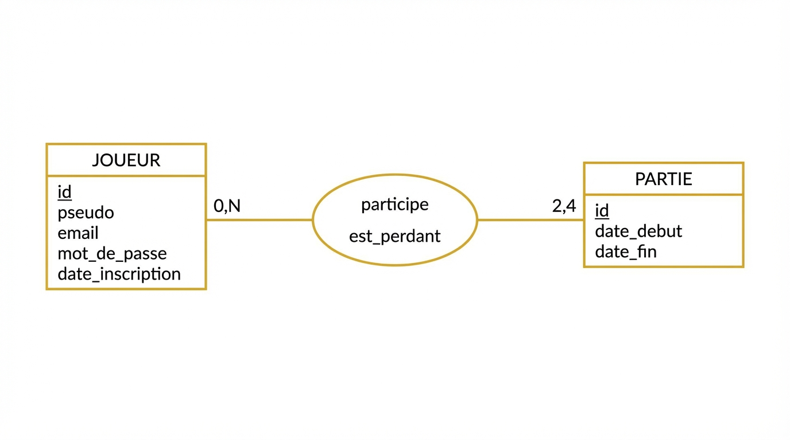
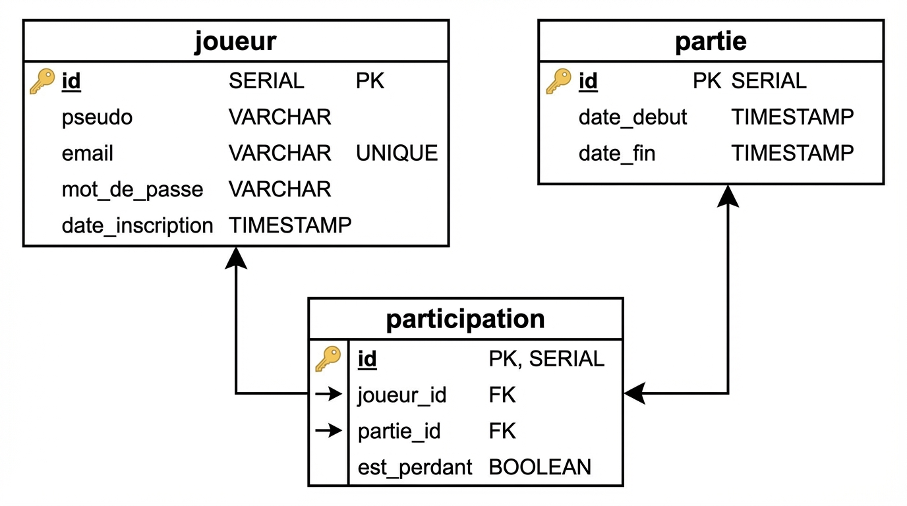

# Document de cadrage - Le Pouilleux

Module : Développement d'application front/back
Rendu : document de cadrage
Dépôt GitHub : [https://github.com/ElyesGhouaiel/pouilleux-online](https://github.com/ElyesGhouaiel/pouilleux-online)

---

## 1. Brief Projet

### 1.1 Présentation générale

Nom du projet : Le Pouilleux

Description : c'est un jeu de cartes en ligne, du classique "Pouilleux" (aussi appelé Old Maid en anglais). On joue à 2, 3 ou 4 joueurs en temps réel. L'idée c'est de pouvoir retrouver ses potes à distance pour une petite partie comme on le ferait autour d'une table.

Problème résolu : à la base je voulais juste un projet simple autour d'un jeu que je connais et que j'aime bien. Mais en y réfléchissant, il y a vraiment un truc : on peut pas toujours être au même endroit pour jouer, ou on est pas assez nombreux. L'appli règle les deux : on joue à distance, et s'il manque du monde on ajoute des bots.

Public cible : n'importe qui qui aime les jeux de cartes, plutôt des gens casual, entre amis ou en famille. Pas besoin d'être un gamer.

### 1.2 Arborescence

Voilà comment on navigue dans l'appli :

```
/login          -> connexion
/register       -> inscription
/lobby          -> salon principal
    - créer une salle
    - rejoindre une salle (via code)
    - salle d'attente (liste joueurs, ajouter bot, lancer la partie)
/game           -> partie en cours
    - phase de préparation (60s, pour défausser les paires initiales)
    - main du joueur
    - cartes des adversaires (dos visible)
    - actions (piocher, défausser, mélanger)
    - timer 30s par tour
    - bouton "je suis prêt" en phase de prep
    - bouton abandon avec confirmation
    - écran de fin (rejouer / retour lobby)
```

Pas de dashboard compliqué, l'idée c'est que le joueur arrive directement dans le lobby après connexion et puisse lancer une partie en 2 clics.

### 1.3 Wireframes

Je les ai faits rapidement en ASCII parce que j'ai pas eu le temps de passer sur Figma pour l'instant. L'idée c'est juste de montrer la structure des écrans, pas le design final.

#### Connexion

```
+------------------------------+
|       LE POUILLEUX           |
|                              |
|    [ email            ]      |
|    [ mot de passe     ]      |
|                              |
|    [   se connecter   ]      |
|                              |
|    Pas de compte ?           |
|    > S'inscrire              |
+------------------------------+
```

#### Lobby (hors salle)

```
+------------------------------------------+
|  LE POUILLEUX        elyes [déconnexion] |
|                                          |
|  +-------------+   +-------------------+ |
|  |  CRÉER      |   |  REJOINDRE        | |
|  |             |   |                   | |
|  | [ créer ]   |   |  [  code     ]    | |
|  |             |   |  [ rejoindre ]    | |
|  +-------------+   +-------------------+ |
+------------------------------------------+
```

#### Salle d'attente

```
+----------------------------+
|    SALLE : A3F8X2          |
|  Partage ce code à tes amis|
|                            |
|  Joueurs (3/4)             |
|   - elyes (toi)            |
|   - alice                  |
|   - Bot 1                  |
|                            |
|  [ + bot ]  [ lancer ]     |
+----------------------------+
```

#### Partie (phase de préparation)

```
+-----------------------------------------------+
| Phase de préparation · défausse tes paires    |
| 47s                           [ abandonner ]  |
|-----------------------------------------------|
|    alice [prêt]    Bot 1 [prêt]               |
|   [?][?][?]        [?][?][?][?]               |
|-----------------------------------------------|
| [ je suis prêt ] [ mélanger ] [ défausser ]   |
|                                               |
| [5h] [Rh] [5p] [Vc] [Vp] [7h] [As]            |
+-----------------------------------------------+
```

#### Partie (tours normaux)

```
+-----------------------------------------------+
| À toi de jouer                  25s           |
|                               [ abandonner ]  |
|-----------------------------------------------|
|    alice            Bot 1 (à toi de piocher)  |
|   5 cartes          [?][?][?] <- clique       |
|-----------------------------------------------|
| Ma main (6)                                   |
| [ mélanger ] [ défausser la paire ]           |
|                                               |
| [5h] [Rs] [3d] [Vc] [7h] [3s]                 |
|              ^ sélectionnée                   |
+-----------------------------------------------+
```

#### Fin de partie

```
+---------------------------+
|      TU AS GAGNÉ !        |
|                           |
|   Le pouilleux : bob      |
|                           |
|   [ rejouer ]  [ lobby ]  |
+---------------------------+
```

### 1.4 Liste des fonctionnalités

Je classe par priorité MoSCoW.

| Priorité | Fonctionnalité | Description courte | Rôle concerné |
|---|---|---|---|
| Must have | Inscription / connexion | L'utilisateur crée un compte (pseudo, email, mdp) et se connecte | Tous |
| Must have | Authentification JWT | Token signé envoyé dans le header pour sécuriser les routes API | Tous |
| Must have | Créer une salle | Génère un code à 6 caractères à partager avec les potes | Joueur hôte |
| Must have | Rejoindre une salle | Via le code partagé | Joueur invité |
| Must have | Distribution des cartes | Max 9 cartes par joueur, une seule carte solo = le pouilleux | Tous |
| Must have | Phase de préparation | 60s au début pour défausser les paires initiales | Tous |
| Must have | Défausser une paire | Sélection manuelle des 2 cartes de même valeur | Tous |
| Must have | Piocher chez l'adversaire | Carte face cachée, tirage aléatoire côté joueur | Joueur dont c'est le tour |
| Must have | Détection du perdant | Celui qui reste avec le pouilleux à la fin | Tous |
| Should have | Timer 30s par tour | Pioche auto si le joueur ne fait rien | Tous |
| Should have | Bouton "je suis prêt" | Skip la phase de préparation si tout le monde a fini | Tous |
| Should have | Bouton abandon | Quitter une partie en cours (compté comme défaite) | Tous |
| Should have | Mélanger sa main | Brouille l'ordre avant que l'adversaire pioche | Joueur dont on va piocher |
| Should have | Bot joueur | Remplit une place vide quand on est pas assez | Joueur hôte |
| Should have | Historique des parties | Liste des parties passées, gagnées/perdues | Tous |
| Should have | Bouton rejouer | Relance une partie en fin de jeu avec les mêmes joueurs | Joueur hôte |
| Should have | Assistant IA | Chatbot qui donne des conseils pendant la partie | Tous |
| Nice to have | Animations cartes | Transitions fluides sur la pioche / défausse | Tous |
| Nice to have | Effets sonores | Sons de pioche, défausse, victoire | Tous |
| Nice to have | Classement global | Leaderboard des meilleurs joueurs | Tous |

---

## 2. Modélisation de la base de données

### 2.1 MCD

Y'a pas grand chose à modéliser, parce que l'état d'une partie en cours (cartes, tours, etc.) reste en mémoire côté serveur pendant le jeu. En base, je stocke juste ce qui doit persister :

- les comptes joueurs
- l'historique des parties (date début/fin)
- qui a joué quoi (et qui a perdu)

Les entités :

- JOUEUR (id, pseudo, email, mot_de_passe, date_inscription)
- PARTIE (id, date_debut, date_fin)

Et entre les deux, une association `participe` qui porte un attribut `est_perdant`.

Cardinalités :

- un joueur peut participer à 0 ou plein de parties
- une partie a toujours entre 2 et 4 joueurs

Donc : Joueur (0,N) --- participe --- (2,N) Partie (avec la contrainte métier "2 à 4" gérée côté appli, pas en base).



### 2.2 MLD

La relation N,N donne une table de liaison `participation`. Les clés primaires sont soulignées, les clés étrangères préfixées par `#`.

```
joueur (id, pseudo, email, mot_de_passe, date_inscription)
    où id est la clé primaire

partie (id, date_debut, date_fin)
    où id est la clé primaire

participation (id, #joueur_id, #partie_id, est_perdant)
    où id est la clé primaire
    joueur_id réfère à joueur(id)
    partie_id réfère à partie(id)
```

Les colonnes en détail :

- joueur : id (SERIAL, PK), pseudo (VARCHAR 50), email (VARCHAR 100, UNIQUE), mot_de_passe (VARCHAR 255), date_inscription (TIMESTAMP, défaut NOW())
- partie : id (SERIAL, PK), date_debut (TIMESTAMP), date_fin (TIMESTAMP, nullable si partie en cours)
- participation : id (SERIAL, PK), joueur_id (INTEGER, FK), partie_id (INTEGER, FK), est_perdant (BOOLEAN, défaut FALSE)

Pour les stats type "nombre de victoires" je fais juste un COUNT sur `participation` au moment où on en a besoin, pas besoin de stocker ça séparément.



### 2.3 MPD

Script SQL exécutable sur PostgreSQL :

```sql
CREATE TABLE joueur (
    id SERIAL PRIMARY KEY,
    pseudo VARCHAR(50) NOT NULL,
    email VARCHAR(100) NOT NULL UNIQUE,
    mot_de_passe VARCHAR(255) NOT NULL,
    date_inscription TIMESTAMP DEFAULT NOW()
);

CREATE TABLE partie (
    id SERIAL PRIMARY KEY,
    date_debut TIMESTAMP NOT NULL,
    date_fin TIMESTAMP
);

CREATE TABLE participation (
    id SERIAL PRIMARY KEY,
    joueur_id INTEGER NOT NULL REFERENCES joueur(id),
    partie_id INTEGER NOT NULL REFERENCES partie(id),
    est_perdant BOOLEAN DEFAULT FALSE
);
```

Je l'ai testé, ça passe sans erreur. Dans le projet j'utilise Prisma comme ORM donc je gère les migrations via `prisma migrate`, mais le SQL généré est équivalent à ce qu'il y a au-dessus.

---

## 3. Stack technique

### 3.1 Frontend

| Élément | Choix | Justification |
|---|---|---|
| Framework | React 18 | Interface très réactive aux events Socket.io : le state qui change déclenche le re-render, pas besoin de manipuler le DOM à la main. Je suis à l'aise avec et c'est la techno la plus demandée en entreprise. |
| Bundler / dev server | Vite | Beaucoup plus rapide que Create React App au dev (HMR quasi instantané). Build de prod optimisé out-of-the-box. Config minimale. |
| Langage | JavaScript | Vu le temps imparti, TypeScript me rajouterait du boulot de typage pour un projet de cette taille. Je préfère bien faire en JS que mal faire en TS. |
| UI / CSS | CSS vanilla dans `index.css` | L'UI est simple (4 écrans), ça vaut pas le coup de sortir Tailwind ou Material UI. Garder léger, moins de dépendances = moins de bugs. |
| Routage | React Router v7 | Standard de facto avec React pour le routing SPA. Gère les routes protégées (auth) via wrappers. |
| Temps réel | socket.io-client | Pendant client de Socket.io. Reconnexion auto, fallback long-polling, API identique côté serveur. |

### 3.2 Backend

| Élément | Choix | Justification |
|---|---|---|
| Runtime | Node.js 20+ | Event loop non bloquant, parfait pour le temps réel avec Socket.io (le serveur gère plein de connexions simultanées sans thread par client). Même langage que le front = moins de context switching. |
| Framework HTTP | Express 5 | Ultra-minimaliste, je contrôle tout. Pour une API avec une dizaine de routes, un framework plus lourd (NestJS, Fastify...) apporte pas grand chose. |
| Langage | JavaScript | Cohérent avec le front. |
| Authentification | JWT (`jsonwebtoken`) | Stateless : pas de stockage serveur des sessions, le token contient les infos du joueur. Scale facilement si je passe en multi-instance. Mon middleware custom vérifie le token sur les routes sensibles. |
| Hash de mot de passe | `bcryptjs` | Standard Node. Salt auto, comparaison safe contre timing attacks. Coût configurable (je suis à 10 rounds). |
| ORM | Prisma 6 | Type-safe (même en JS, l'auto-complétion est correcte via le client généré). Migrations gérées via CLI. Évite les injections SQL. Schéma déclaratif clair. |
| WebSockets | Socket.io 4 | Rooms / events natifs, parfait pour le jeu multijoueur (broadcast dans une salle). Authentification via JWT au handshake. Gestion des déconnexions. |
| Tests | `node:test` (natif) | Test runner intégré à Node 20+, pas besoin d'installer Jest. Syntaxe proche de ce que je connais, zéro config. |

### 3.3 Base de données

| Élément | Choix | Justification |
|---|---|---|
| SGBD | PostgreSQL 16 | Contrainte du projet (relationnel). Parmi les options relationnelles, Postgres est robuste, open source, très bien supporté par Prisma, et gère les types avancés si j'en ai besoin plus tard (JSONB, arrays). |
| Hébergement dev | Docker Compose | Un `docker-compose.yml` qui lance postgres en conteneur. Ma machine reste propre, et n'importe qui qui clone le repo lance la DB en une commande (`docker compose up`). |
| Hébergement prod | Supabase ou Railway (à décider) | Services managés avec un tier gratuit suffisant pour un projet étudiant. Backups auto, pooling de connexions. |

### 3.4 Outils & infrastructure

| Élément | Choix |
|---|---|
| Versioning | Git + GitHub |
| Déploiement front | Vercel (SPA, déploiement auto depuis la branche main) |
| Déploiement back | Railway ou Render (Vercel gère mal les WebSockets long-lived) |
| Conteneurisation DB | Docker Compose en local |
| Gestion de projet | Issues GitHub + le README pour les grandes étapes (projet solo, je m'embête pas avec Trello / Notion) |
| CI/CD | Pas encore en place, à ajouter plus tard (GitHub Actions pour lancer `npm test` sur chaque push) |

---

## 4. Architecture technique

### 4.1 Vue d'ensemble

Trois briques qui communiquent :

```
┌───────────────┐    HTTP/JSON     ┌──────────────────┐    SQL     ┌────────────┐
│  Client       │ ───────────────→ │  Backend         │ ─────────→ │ PostgreSQL │
│  React (Vite) │                  │  Node + Express  │            │ (Docker)   │
│  localhost    │ ← WebSocket ───→ │  Socket.io       │            └────────────┘
│  :5173        │                  │  :3000           │
└───────────────┘                  │                  │    HTTPS   ┌────────────┐
                                   │                  │ ─────────→ │ Mistral    │
                                   └──────────────────┘            │ AI API     │
                                                                   └────────────┘
```

- **HTTP REST (JSON)** pour tout ce qui est authentification, profil, historique, chatbot IA
- **WebSocket** pour le temps réel du jeu (créer/rejoindre une salle, jouer une carte, recevoir les updates)
- **Prisma** entre Node et Postgres (ORM, migrations)
- **Mistral** pour l'assistant IA en jeu

### 4.2 Flux d'une action de jeu (défausse d'une paire)

C'est représentatif de la plupart des interactions temps réel :

```
Client (Game.jsx)
  |  sélection 2 cartes → clic "Défausser"
  |
  |  socket.emit("discard-pair", { cardId1, cardId2 })
  ↓
Serveur (sockets/index.js)
  |  récupère la room et l'engine du joueur
  |  → engine.discardPair(playerId, cardId1, cardId2)
  |       vérifie que les cartes sont dans la main
  |       vérifie que c'est bien une paire
  |       retire les 2 cartes, les met en défausse
  |       si main vide → joueur éliminé
  |       si un seul joueur restant → partie finie
  |  broadcast "game-update" à tous les sockets de la room
  |  si partie finie → sauvegarde en base (Prisma)
  ↓
Chaque client de la room
  |  reçoit "game-update"
  |  setGameState(nouveau state) → React re-render → UI à jour
```

Chaque client ne reçoit que **sa propre main** dans le state, jamais celle des autres (voir `Engine.getStateForPlayer`). Pas de triche possible.

### 4.3 Gestion d'état côté React

- **`AuthContext`** : contient le token (persisté dans `localStorage`), l'utilisateur, et les fonctions `login / register / logout`. Enveloppe toute l'appli. Le token est envoyé à chaque fetch et au handshake Socket.io.
- **`SocketContext`** : instance unique de `socket.io-client`, créée dès qu'un token est disponible. Elle est partagée entre le Lobby et la page Game pour que la connexion (et donc la room) survive à la navigation.
- **Composants** : `useState` pour l'UI locale (sélection de cartes, message d'erreur, timer, modal d'abandon). L'état du jeu vient exclusivement du serveur via l'event `game-update`, ce qui garantit qu'aucun client ne peut décider tout seul de l'état de la partie.

---

## 5. API REST

Toutes les routes retournent du JSON. Les erreurs sont au format `{ "error": "..." }`.

### 5.1 Routes publiques

| Méthode | Endpoint | Body | Réponse ok | Codes possibles |
|---|---|---|---|---|
| POST | `/api/register` | `{ pseudo, email, password }` | `{ id, pseudo, email }` | 201, 400 (champs manquants), 409 (email pris), 500 |
| POST | `/api/login` | `{ email, password }` | `{ token, pseudo }` | 200, 400 (champs manquants), 401 (mauvais mdp), 404 (compte introuvable), 500 |

### 5.2 Routes protégées (JWT dans le header `Authorization: Bearer <token>`)

| Méthode | Endpoint | Réponse ok | Codes possibles |
|---|---|---|---|
| GET | `/api/me` | `{ id, pseudo, email, dateInscription }` | 200, 401 (token manquant), 403 (token invalide/expiré), 404 |
| GET | `/api/history` | Liste des parties du joueur avec date début/fin et résultat | 200, 401, 403, 500 |
| POST | `/api/ai/chat` | `{ reply }` (texte généré par Mistral) | 200, 400 (message manquant), 401, 403, 502 (erreur appel Mistral), 503 (IA non configurée) |

### 5.3 Choix REST

- Verbes HTTP standard : `POST` pour créer, `GET` pour lire
- Codes normalisés : 2xx succès, 4xx erreur client, 5xx erreur serveur
- Format d'erreur unifié dans tout le back : `{ "error": "..." }`
- Les routes de jeu (créer une salle, jouer une carte, mélanger sa main...) passent par **Socket.io** et pas par REST, parce que le jeu est bidirectionnel et doit propager les updates à tous les joueurs de la salle en même temps. REST serait mal adapté (polling coûteux, pas de push).

### 5.4 Événements Socket.io (pour complétude)

Résumé rapide, détails dans `server/sockets/index.js` :

- `create-room`, `join-room`, `add-bot`, `start-game` : gestion de la salle
- `player-ready` : marquer prêt en phase de préparation
- `discard-pair`, `draw-card`, `shuffle-hand` : actions de jeu
- `leave-game`, `rematch` : fin/relance de partie
- Serveur → clients : `room-update`, `game-start`, `game-update`, `timer-tick`, `prep-tick`

---

## 6. Sécurisation

### 6.1 Hash des mots de passe

`bcryptjs` avec 10 rounds. Le mot de passe brut n'est jamais stocké, ni loggé. À la connexion, on compare avec `bcrypt.compare` qui est safe contre les attaques par timing.

### 6.2 JWT

- Signature avec `JWT_SECRET`, stocké dans `.env` (jamais commit, `.env.example` sert de template)
- Expiration à 24h
- Payload minimal : `{ id, pseudo }`, aucune donnée sensible
- Côté HTTP : middleware Express (`server/middleware/auth.js`) qui lit le header `Authorization: Bearer <token>`, vérifie la signature, injecte `req.user`
- Côté Socket.io : vérification au handshake via `io.use()`, le socket est refusé si le token est invalide ou absent. Une fois validé, `socket.user` est disponible dans tous les handlers

### 6.3 Rôles

L'appli a deux rôles fonctionnels, pas de hiérarchie complexe :

- **Joueur connecté** : peut créer un compte, se connecter, jouer, voir son profil et son historique
- **Hôte d'une salle** : c'est le joueur qui a créé la salle. C'est le seul autorisé à ajouter des bots et à lancer la partie. Vérifié dans les handlers Socket.io (`start-game`, `add-bot`) par comparaison de `socket.user.id` avec `room.host`

Pas de rôle "admin" parce que l'appli n'en a pas l'utilité (pas de modération, pas de backoffice).

### 6.4 Autres protections

- `/api/ai/chat` est protégée par JWT pour que personne ne puisse cramer mon quota Mistral en spammant l'endpoint
- Injection SQL : impossible parce que je passe par Prisma qui paramétrise tout
- Injection dans les payloads : Express `json` parse et rejette le payload malformé
- CORS ouvert (`origin: "*"`) : c'est acceptable en dev, à restreindre au domaine prod plus tard
- Les mots de passe ne sont pas renvoyés par le back, même dans les réponses de `/api/me`

---

## 7. Fonctionnalité IA

Dans le projet il y a deux trucs qui touchent à l'IA, mais seul un des deux entre vraiment dans la définition "appel à un modèle IA" demandée par le cadrage. Je parle quand même des deux pour être clair.

### 7.1 Fonctionnalité principale : un assistant qui te conseille pendant la partie

C'est un petit chatbot accessible via un bouton (l'ampoule en bas à droite de la page de jeu). Tu peux lui poser des questions pendant ta partie :

- "qu'est-ce que tu me conseilles ?"
- "je dois mélanger ma main ou pas ?"
- "rappelle-moi les règles du Pouilleux"

Le truc intéressant c'est qu'il connaît le contexte : je lui envoie l'état du jeu (ma main, les cartes des adversaires, à qui c'est le tour), donc il peut vraiment donner un conseil adapté et pas juste parler dans le vide.

Ça sert à quoi concrètement :

- pour les joueurs qui connaissent pas les règles, ils peuvent demander sans quitter le jeu
- pour ceux qui hésitent sur un coup, ça leur donne un avis extérieur (c'est un peu comme avoir quelqu'un à côté de soi qui te conseille)

### 7.2 Choix technique

Modèle : Mistral AI, précisément `mistral-small-latest`. J'ai choisi Mistral pour plusieurs raisons :

- c'est français, bon niveau en français (et mon appli est en français)
- le tier gratuit est large, pas besoin de sortir la carte bancaire pour tester
- leur API est compatible OpenAI, donc si plus tard je veux switcher c'est trivial

L'appel au modèle se fait côté backend, pas côté front. Ça évite deux problèmes : ma clé API serait exposée dans le navigateur si je faisais l'appel depuis le front, et je veux pouvoir protéger l'endpoint avec mon middleware JWT (seuls les utilisateurs connectés peuvent utiliser l'IA, pour pas que n'importe qui vienne griller mon quota).

Le flux ressemble à ça :

```
Page Game (React) 
  -> POST /api/ai/chat + JWT + { message, context }
Backend (routes/ai.js)
  -> middleware JWT vérifie le token
  -> fetch vers api.mistral.ai
Mistral
  -> réponse texte
Backend 
  -> renvoie au front qui affiche dans le chat
```

En entrée j'envoie :

- un system prompt qui cadre le rôle de l'IA (assistant Pouilleux, règles, ton sympa, réponses courtes en français)
- la question du joueur
- le contexte du jeu (ma main, cartes des autres, tour en cours)

En sortie je récupère : du texte (200 tokens max, pour rester court et pas faire exploser la latence).

Extrait du code (dans `server/routes/ai.js`) :

```js
const response = await fetch("https://api.mistral.ai/v1/chat/completions", {
  method: "POST",
  headers: {
    "Content-Type": "application/json",
    Authorization: `Bearer ${apiKey}`,
  },
  body: JSON.stringify({
    model: "mistral-small-latest",
    messages: [
      { role: "system", content: systemPrompt },
      { role: "user", content: userPrompt },
    ],
    max_tokens: 200,
    temperature: 0.7,
  }),
});
```

### 7.3 L'autre "IA" : le bot joueur (pas un LLM)

J'ai aussi un bot qui peut remplacer un joueur humain quand la salle est pas pleine. Mais ce bot-là est codé en algorithmique pur, pas avec un modèle IA. J'explique pourquoi :

La stratégie optimale au Pouilleux tient en 2 lignes : défausser toutes les paires qu'on a dans la main, et piocher au hasard chez le voisin (de toute façon on voit pas ses cartes). Utiliser un LLM pour ça serait overkill, ça ajouterait 1-2 secondes de latence par action (le jeu deviendrait chiant) et ça coûterait cher pour rien.

Donc volontairement, dans `server/game/Bot.js` j'ai fait :

- scan de la main, détection des paires, défausse auto
- pioche random chez le voisin
- délais artificiels (2-4 secondes entre les actions) pour que le bot ait l'air humain et laisser le temps au joueur de suivre ce qui se passe
- phase de préparation : les bots défaussent leurs paires initiales pendant la minute de prep, comme un vrai joueur, et se marquent "prêts" à la fin
- j'utilise le même `GameEngine` que les vrais joueurs, donc pas de triche, le bot voit pas les cartes des autres

C'est un choix assumé : **le LLM sert quand il apporte de la valeur** (parler en langage naturel avec l'utilisateur), pas pour prendre des décisions triviales.

---

## 8. Tests

J'ai écrit une suite de tests unitaires avec le test runner natif de Node (`node --test`, pas besoin d'installer Jest ou Mocha). Ça couvre les parties critiques du moteur de jeu :

- `tests/Deck.test.js` : création du deck, shuffle, détection de paires, préparation du jeu (max 9 cartes par joueur, total impair, une seule carte solo = le pouilleux)
- `tests/Engine.test.js` : distribution des cartes, phase de préparation (markReady, allReady), défausse (valide / invalide), pioche (blocage pendant prep, blocage si pas ton tour), changement de tour, élimination, détection du perdant, protection des mains des autres joueurs dans le state
- `tests/Bot.test.js` : défausse automatique des paires, playPrep qui marque le bot comme prêt, comportement quand le bot est éliminé

33 tests au total, tous passent. Pour les lancer : `npm test` depuis le dossier `server/`.

Ce qui est pas testé : tout ce qui est Socket.io, routes API, et UI React. J'ai priorisé la logique de jeu parce que c'est là qu'il y a le plus de règles à vérifier (et le plus de bugs possibles). Pour le reste je teste manuellement dans le navigateur.